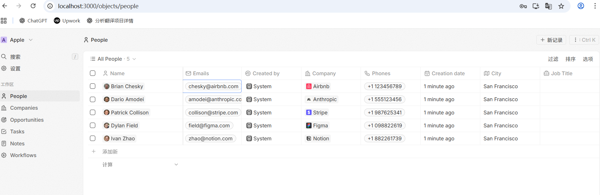
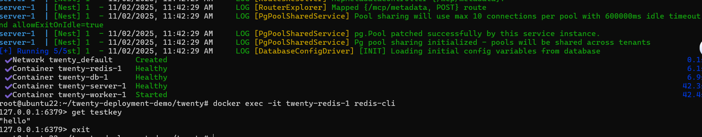
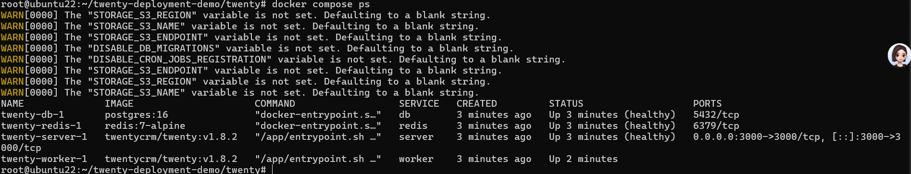

# Twenty Deployment Demo

> **Quick Overview:**  
> This project demonstrates an easy one-line deployment of the Twenty CRM system with enhanced Redis configuration.  
> It features Redis persistence and memory limits for safe local development and demo purposes.  
> Ideal for showcasing on GitHub or for technical demonstrations to clients.

## Project Features
- Official one-line deployment for the Twenty project
- **Redis Optimization**
  - Enabled persistence (AOF + Docker volume)
  - Set maximum memory to 512MB to prevent container OOM
  - Keep the default max-memory policy `noeviction` for safe demonstration
- Suitable for local development, demonstration, and GitHub showcase

## Deployment Instructions
1. Clone the repository

```bash
git clone https://github.com/SterlingAureum/twenty-deployment-demo.git
cd twenty-deployment-demo
```

2. Run the official installation script

```bash
bash scripts/install.sh
```

3. Start the project using the override file

```bash
docker compose -f docker-compose.yml -f docker-compose.override.yml up -d
```

4. Verify Redis persistence

```bash
docker exec -it twenty-redis-1 redis-cli
> set testkey "hello"
> exit
docker compose down
docker compose up -d
docker exec -it twenty-redis-1 redis-cli
> get testkey
"hello"
```

## Optimization Notes
- Keep the official deployment structure

- Redis persistence + memory limit increases both demo and production usability

- The demo project is simple and easy to run

## Project Screenshots

### 1️⃣ Twenty Web Interface
Twenty CRM running locally on `http://localhost:3000`.  
Shows the main dashboard and example data.



---

### 2️⃣ Redis Persistence Test
Demonstrates Redis key-value persistence after container restart.  
Shows that data set in Redis is retained due to AOF + volume configuration.



---

### 3️⃣ Docker Services Status
Displays the current status of Docker containers using `docker compose ps`.  
All services (server, worker, db, redis) are healthy and running.



